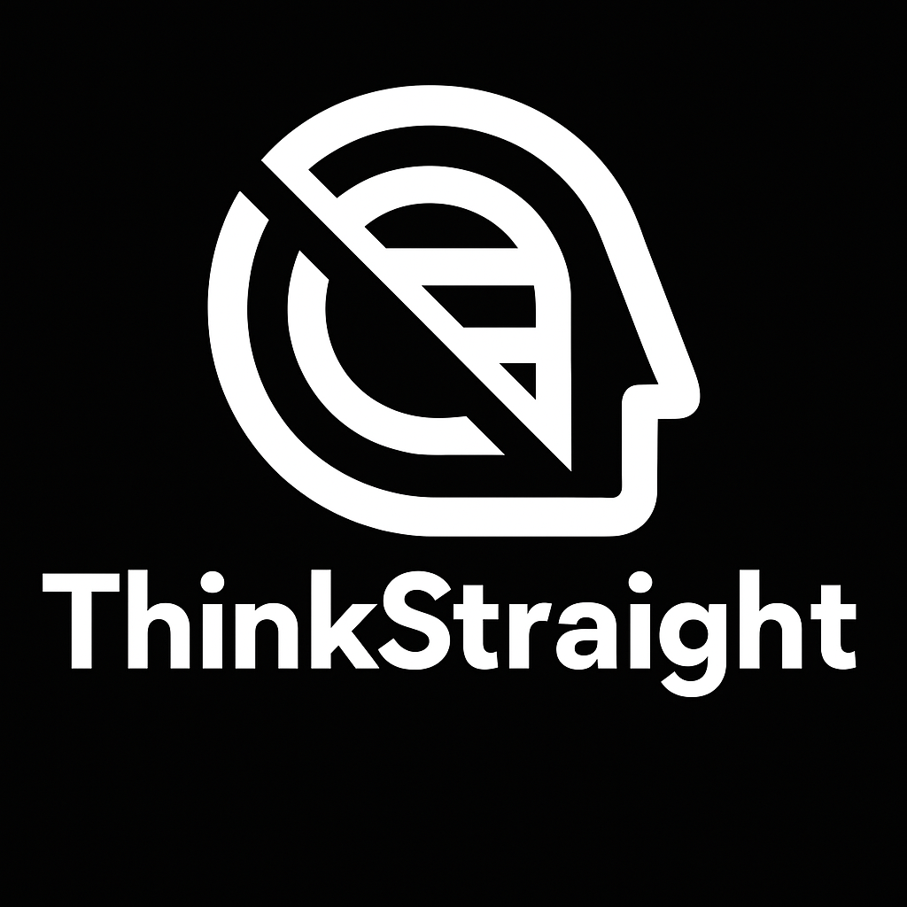

# ThinkStraight - A bias-aware writing assistant powered by Gemini AI

  

# About

ThinkStraight is a AI-based writing Assistant to help eliminate bias from social media platforms. It helps you write with clarity and fairness by detecting cognitive biases in your text and offering balanced, thoughtful rewrites. It also warns you when a message may be harmful or better left unsent. Currently, there's no software to efficiently detect bias amongst social media platfortms or its limited to a simple warning line. Our solution is to use Gemini 2.0 API to identify bias and create thoughtful rewrites.

## Installation

#### Chrome Installation

- Clone this repository
- Run `npm install`
- Run `npm run build`
- Open Chrome and go to chrome://extensions/
- Enable "Developer mode" in the top right
- Click "Load unpacked" and select the extension directory (dist/chrome)

#### Firefox Installation

- Clone this repository
- Run `npm install`
- Run `npm run build`
- Open Firefox and go to about:debugging#/runtime/this-firefox
- Click "Load Temporary Add-on"
- Navigate to the extension directory (dist/firefox) and select manifest.json

## Development

When developing you'll need to run `npx tailwindcss -i src/libs/tw-input.css -o src/libs/tw-output.css --minify --watch` in order to build the css on the fly. The runs automatically when you run `npm run build`.

## Usage

1. Highlight text on any webpage
2. Right-click to open the context menu
3. Select "ThinkStraight" and choose an option
4. Wait for Gemini to process your text

## Default Prompts

1. Analyze Bias
2. Debias Text

## Future Features

Planned features include:

- Support for additional language models (LLMs)
- Enhanced context awareness
- Underline grammar / spelling issues

## Contributing

Contributions are welcome! Feel free to submit a pull request.
